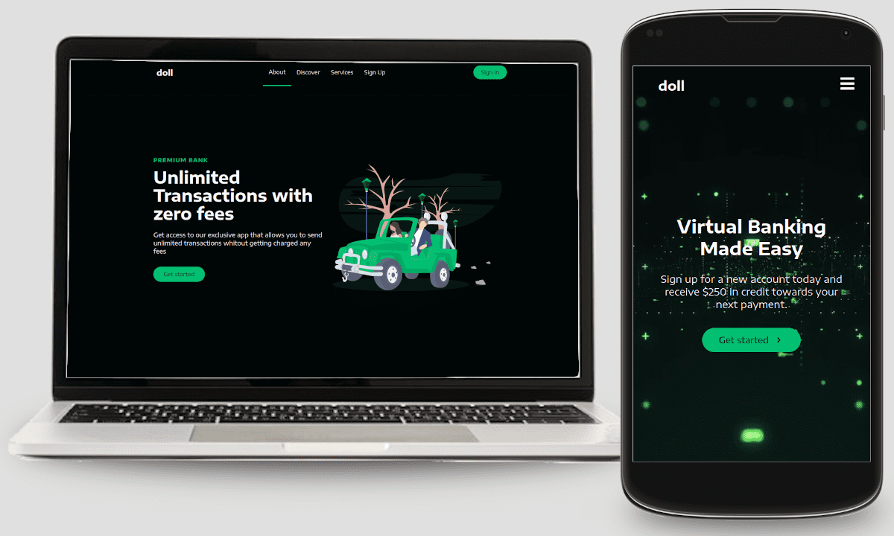

<h1 align="center">Lading Page Doll</h1>


Lading Page Doll es un sitio web desarrollado con React usando Stylecomponents y Smooth Scroll



## Demo

Puede visitar el sitio web demo en el siguiente enlace
[Lading Page Doll](https://ladingpage-doll.netlify.app/)

### Desarrollado con

- [Reactjs](https://es.reactjs.org/)
- [Stylecomponents](https://styled-components.com/)
- [React Icons](https://react-icons.github.io/react-icons/)
- [React Scroll](https://www.npmjs.com/package/react-scroll)

## Instalación

Clonar el proyecto

```bash
git clone https://github.com/carlossantesp/landingpage-doll.git
```

Instalar las dependencias del proyecto

```bash
npm install
```

 o con yarn

 ```
yarn install
 ```

 Ejecutar el servidor de desarrollo

 ```bash
npm run start
```

 o con yarn

 ```
yarn start
 ```

 Compiliar para producción

  ```bash
npm run build
```

 o con yarn

 ```
yarn build
 ```

## Contacto

- GitHub [@carlossantesp](https://github.com/carlossantesp)
- Linkedin [@dev-santillan-carlos](https://www.linkedin.com/in/dev-santillan-carlos)
